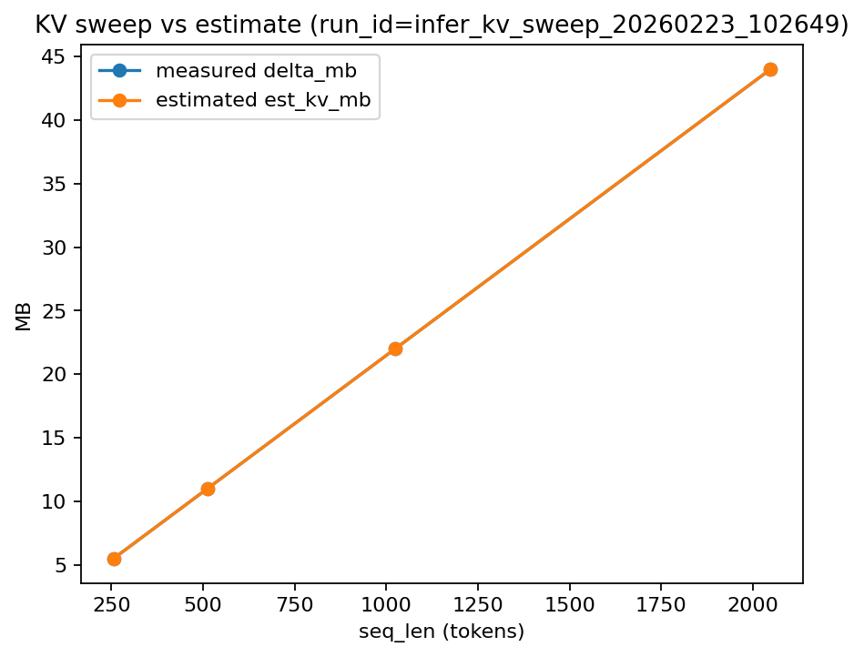

# KV-cache: estimate vs measured (Week 1)

- Latest sweep run_id: `infer_kv_sweep_20260223_102649`
- Model: `TinyLlama/TinyLlama-1.1B-Chat-v1.0`
- DType: `bf16`

## Key result

- **KV growth is linear in seq_len** and the analytical estimator matches measured deltas.
- For this model: **~22.0 KB per token per request** (batch=1, beams=1).

## Plot

## Sweep table (measured vs estimated)

| seq_len | measured delta_mb | estimated est_kv_mb | ratio |
|---:|---:|---:|---:|
| 256 | 5.500 | 5.500 | 1.000 |
| 512 | 11.000 | 11.000 | 1.000 |
| 1024 | 22.000 | 22.000 | 1.000 |
| 2048 | 44.000 | 44.000 | 1.000 |

## Capacity example

With `seq_len=2048` and a KV budget of **2000 MB**,
KV per request is **44.0 MB**, so max concurrency is approximately:

**max_concurrency ≈ floor(2000 / 44.0) = 45**

This is KV-only headroom; real serving capacity also depends on weights, temporary buffers, and fragmentation.
